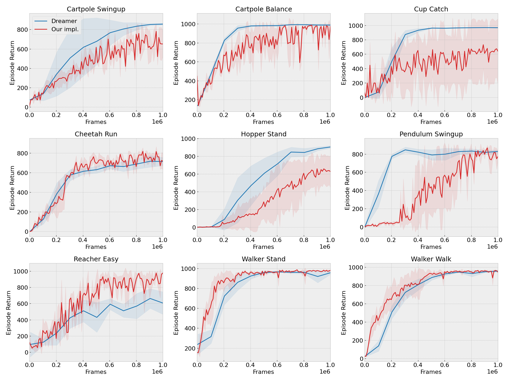

# dreamer-pytorch
IFT6163 course project, PyTorch reimplementation of the [Dreamer](https://arxiv.org/abs/1912.01603) model.

## Dependencies

Install the dependencies as follows:

```sh
conda create -n dreamer-pytorch python=3.8
conda activate dreamer-pytorch
pip install -r requirements.txt
```

You can quickly verify that the dependencies are correctly installed by running the following debugging command:

```
python dreamer.py prefill=100 train_steps=2 batch_size=10 batch_length=10 logdir='./debug/'
```

## Training

To train on, say Cartpole Balance, simply run

```sh
python dreamer.py task='cartpole_balance' logdir='./output/' 
```

All the results, including metrics, video and tensorboard logs will be saved to `'./output/'`. 

## Logging

Tensorboard:

```sh
tensorboard --logdir ./output/ --port 8888 --host 0.0.0.0
```

For videos, check the `video` folder under your experiment run folder.

## If you are getting OOM errors

The default configuration will consume roughly 2.7G GPU memory. If you are getting OOM errors, pass `deterministic=True`. This sets `torch.backends.cudnn.deterministic=True`, which
uses more memory-efficient algorithms for convolution.

## Results

Results for 1M steps, averaged over 3 seeds. `Dreamer` curves are from the official repository.


